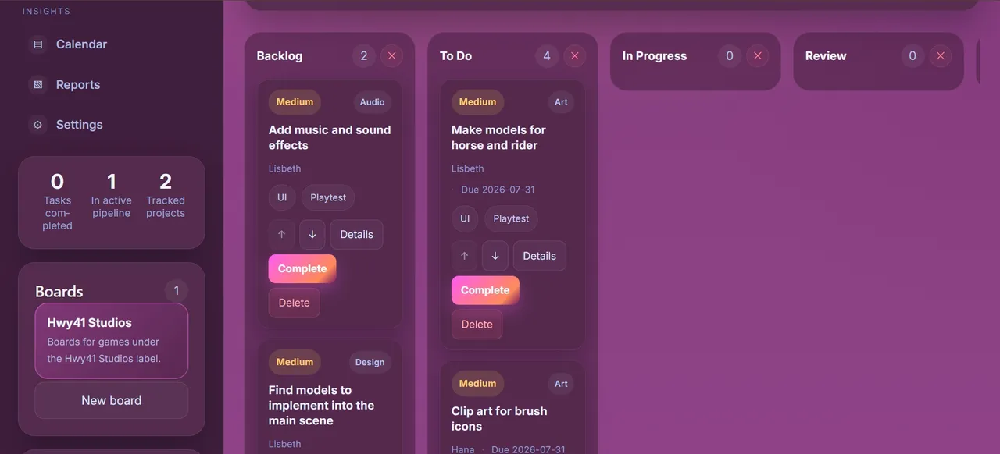
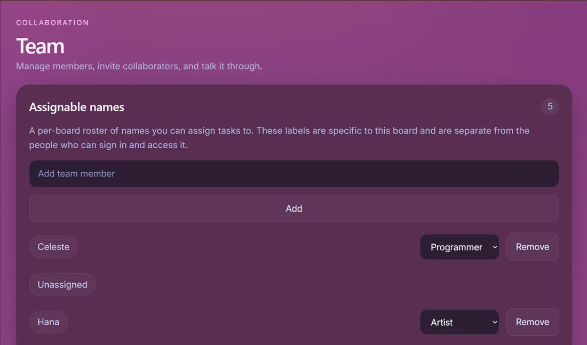
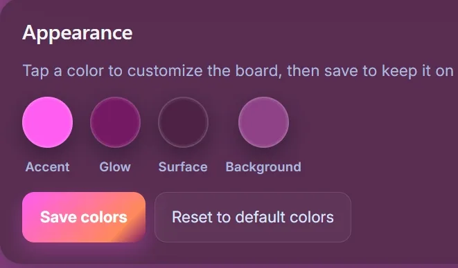
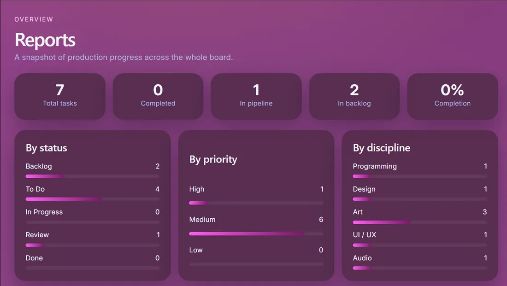
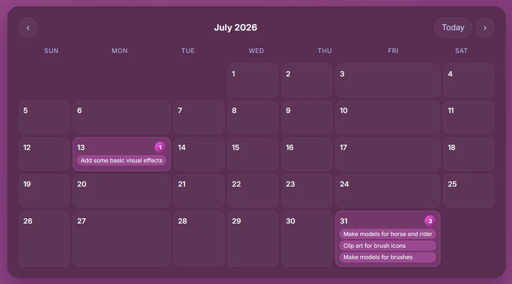

# Inferno

**A free, collaborative task board built for game development.**

Inferno is a shared production board for indie game developers and small studios.
Plan features, assign work, and track a game from backlog to final polish — all on
one dark, focused board.

**Live site: [infernotaskboard.com](https://infernotaskboard.com/)**

> **Release status: alpha / release candidate.** Inferno is stable enough for
> daily use and we are actively polishing it toward a 1.0 release. You may still
> hit rough edges. Bug reports and feedback from early users are very welcome;
> see [How to report issues](#how-to-report-issues) below.



## What is Inferno?

Making a game means juggling a lot of moving parts — art, design, code, audio, QA —
often across a small team where everyone wears several hats. Inferno gives that team
a single place to see what needs doing, who is doing it, and how close the game is to
shipping. It combines a Kanban board, a calendar, and live production reports into
one workspace so nothing slips through the cracks.

It's free to use, and every new account starts with a fully seeded sample board so
you can explore how everything fits together before inviting your team.

## Who it's for

- **Indie game developers** planning a solo or small-team project.
- **Small studios** coordinating art, design, engineering, and QA in one place.
- **Game jam teams** who need to organize fast and ship on a deadline.
- Anyone who wants a focused, game-flavored alternative to a generic task tracker.

## Features

- **Boards** — a shared studio workspace per game or team, with chat and invites built in.
- **Projects** — group work by feature area, milestone, or whole game, and switch between them in a click.
- **Kanban sections** — a Backlog → To Do → In Progress → Review → Done pipeline you can rename and reorder to match how you actually ship.
- **Tasks** — rich cards with assignees, discipline, priority, estimates, due dates, and notes.
- **Due dates & calendar** — pick due dates with a built-in date picker and see them all on a month calendar so deadlines stay visible.
- **Reports** — live production snapshots that roll up totals by status, priority, and discipline to reveal bottlenecks early.
- **Team members** — invite collaborators by email, assign work to a per-board roster, and discuss it in real-time board chat with presence.
- **Board-specific permissions** — each board has its own members and roles (viewer / editor / owner), with ownership transfer and member removal.
- **Customization** — set per-board task tags, game categories, and team roles, plus a live color editor for accent, glow, surface, and background.
- **Profile & settings** — a personal profile (display name, gamer tag, pronouns, avatar) and appearance settings that persist to your account.
- **Mobile support** — a touch-friendly layout so you can check progress on the go.
- **Landing page** — a polished public marketing page introducing the product to new visitors.

### A closer look

| | |
|---|---|
|  |  |
| **Collaboration** — invite teammates, assign a per-board roster, and chat in real time. | **Custom workflow** — reshape sections and restyle the board to fit your process. |
|  |  |
| **Reports** — totals by status, priority, and discipline across the board. | **Calendar** — every due date on a single month view. |

## How it works

1. **Sign up** — create a free account. You'll land on a fully seeded sample board that shows how projects, tasks, and sections work.
2. **Create a board** — spin up a workspace for your own game or studio.
3. **Plan the work** — add projects, break them into tasks, and drag cards across the Kanban pipeline from backlog to done.
4. **Invite your team** — send email invites, assign tasks to members, and talk it through in board chat.
5. **Track progress** — watch due dates on the calendar and production health in live reports as you ship together.

## Security & permissions

Access in Inferno is **board-specific**. Invitations are always tied to a single
board, and members can only see and work on the boards they've actually been invited
to — one team's board is never visible to another. Within a board, each member has a
role (viewer, editor, or owner), owners can transfer ownership or remove members, and
these boundaries are enforced at the database level. This lets a studio safely run
several separate boards from one account.

## Tech stack

- **Frontend:** React + [Vite](https://vitejs.dev/)
- **Backend & auth:** [Supabase](https://supabase.com/) (Postgres, authentication, row-level security, and Edge Functions)
- **Transactional email:** [Resend](https://resend.com/) for board invitation emails
- **Hosting:** IONOS Deploy Now, serving the production domain [infernotaskboard.com](https://infernotaskboard.com/)

---

# Developer guide

The rest of this document covers local development, configuration, and deployment.

## Environment variables

This app talks to Supabase and needs two variables **at build time** (Vite inlines
`VITE_*` variables into the client bundle — they are not read at runtime):

- `VITE_SUPABASE_URL`
- `VITE_SUPABASE_ANON_KEY`

Optional:

- `VITE_SITE_URL` — canonical site URL used for auth email-confirmation redirects
  and invite accept links. Defaults to `https://infernotaskboard.com/` when unset.
  Set it to `http://localhost:5173` for local development.

Local development: copy `.env.example` to `.env` and fill in your values.

## Deploying to IONOS Deploy Now

The build runs in `.github/workflows/Inferno-build.yaml` (`npm ci && npm run build`,
output folder `dist`). Because Vite embeds env vars during the build, you **must**
add the Supabase values as GitHub repository secrets before the production build,
otherwise the deployed site crashes with `supabaseUrl is required`:

1. Repo **Settings → Secrets and variables → Actions → New repository secret**
2. Add `VITE_SUPABASE_URL` and `VITE_SUPABASE_ANON_KEY`

The workflow already maps these secrets into the build environment.

## Invitation emails (Resend)

Board invitations are delivered by the `send-board-invite` Supabase Edge Function
(`supabase/functions/send-board-invite/index.ts`), which posts to the Resend HTTPS
API. The frontend still generates the `acceptUrl` and calls the function via
`supabase.functions.invoke('send-board-invite', ...)`.

### 1. Verify the sending domain in Resend

1. In the Resend dashboard, add the domain `infernotaskboard.com`.
2. Resend shows a set of DNS records (SPF/`TXT`, DKIM `CNAME`/`TXT`, and an optional
   DMARC `TXT`).
3. In **IONOS → Domains → infernotaskboard.com → DNS**, add each record exactly as
   Resend provides it (host/name and value), then save.
4. Back in Resend, click **Verify**. Propagation can take a few minutes to a few
   hours. The sender `celeste@infernotaskboard.com` only works once the domain is
   verified.

### 2. Set the Edge Function secrets

These are server-side secrets — never prefix them with `VITE_` and never commit them:

```bash
supabase secrets set \
  RESEND_API_KEY="re_..." \
  INVITE_FROM_EMAIL="Inferno <celeste@infernotaskboard.com>"
```

- `RESEND_API_KEY` **(required)** — the function returns a 500 JSON error if missing.
- `INVITE_FROM_EMAIL` *(optional)* — defaults to `Inferno <celeste@infernotaskboard.com>`.

The invite link (`acceptUrl`) is built in the browser from `VITE_SITE_URL` (falling
back to `https://infernotaskboard.com/`) and sent to the function, so no
`SITE_URL`/`APP_URL` secret is required for the function itself.

## Supabase Auth URL configuration

Email confirmation and magic-link redirects are controlled by Supabase, not the app.
In the Supabase dashboard under **Authentication → URL Configuration**:

- **Site URL**: `https://infernotaskboard.com`
- **Redirect URLs**: add `https://infernotaskboard.com/**` (and any local dev origin,
  e.g. `http://localhost:5173/**`)

The signup flow also passes `emailRedirectTo` derived from `VITE_SITE_URL`, so
confirmation links return users to the production domain instead of localhost.

## Database migrations

Schema changes live in `supabase/migrations/`. Apply them with the Supabase CLI
from the project root:

```bash
# One-time: link the local project to your Supabase project (skip if already linked).
# The <ref> is the Project Ref from Supabase → Project Settings → General.
supabase link --project-ref <ref>

# Push every pending migration in supabase/migrations to the linked project.
supabase db push
```

All migrations are idempotent and non-destructive, so `supabase db push` is safe
to re-run.

Current migrations:

- `20260708000000_add_kanban_sections.sql` — adds a `kanban_sections` `jsonb`
  column to `boards` (defaulted to the standard five-lane pipeline) so each
  board's Kanban columns persist.
- `20260709000000_add_profile_fields.sql` — adds the personalization columns
  (`avatar_url`, `gamer_tag`, `pronouns`, `onboarding_seen_at`, `display_name`)
  to `profiles`.
- `20260710000000_profiles_rls_policies.sql` — enables row level security on
  `profiles` and creates the read / insert / update policies.
- `20260711000000_repair_profile_columns.sql` — idempotent repair that
  re-asserts every profile column, re-creates the RLS policies, and refreshes
  the PostgREST schema cache. Fixes environments where `supabase db push`
  reports "up to date" but the columns are still missing.
- `20260712000000_add_profile_theme_settings.sql` — adds a nullable
  `theme_settings` `jsonb` column to `profiles` so the **Settings → Appearance**
  swatches (accent, glow, surface, background) persist per user. A null value
  means "use the default theme". The existing update RLS policy already covers
  it, so no policy change is needed.
- `20260713000000_add_mobile_board_hint.sql` — adds a nullable
  `mobile_board_hint_seen_at` `timestamptz` column to `profiles` so the one-time
  mobile "swipe through the board" hint stays dismissed per user. A null value
  means "hint not yet dismissed". The existing update RLS policy already covers
  it, so no policy change is needed. If the migration has not been applied, the
  hint is simply hidden rather than repeatedly shown.
- `20260714000000_add_board_settings_and_member_role.sql` — adds a `settings`
  `jsonb` column to `boards` (defaulted to `{}`) that stores per-board custom
  **task tags**, **game categories**, and **team roles**, plus a nullable
  `role` `text` column to `team_members` for each member's assigned role. Both
  are non-destructive: if the migration has not been applied, the app falls back
  to the built-in defaults and simply cannot persist new customizations.
- `20260715000000_board_collaboration_rls_and_rpcs.sql`: adds the board
  collaboration model, including row level security policies and the RPCs that
  power sharing a board with teammates.
- `20260716000000_add_delete_board_rpc.sql`: adds the RPC that deletes a board
  and its dependent rows safely under RLS.
- `20260717000000_add_gamification_fields.sql`: adds the gamification columns
  (XP, level, streak) used by the Progress panel.
- `20260718000000_add_project_boss_fights.sql`: adds the project boss fight
  fields that model milestones as boss encounters.
- `20260719000000_add_campfire_messaging.sql`: adds the Campfire board chat
  tables and their RLS policies.
- `20260720000000_add_campfire_channels.sql`: adds user-created Campfire
  channels so each board can organize chat into topics.
- `20260721000000_add_board_docs.sql`: adds the Docs Hub table that links
  documents to a board, with board-scoped RLS.
- `20260722000000_add_board_repositories.sql`: adds the Code Forge table that
  links repositories to a board, with board-scoped RLS.
- `20260723000000_add_meeting_notes.sql`: adds the War Room meeting notes table
  and its board-scoped RLS policies.
- `20260724000000_add_notification_reads.sql`: adds the table that remembers
  which notifications each user has read.
- `20260725000000_add_task_links.sql`: adds the table that links related tasks
  together.
- `20260726000000_grant_board_docs_privileges.sql`: grants the table privileges
  on `board_docs` to the `authenticated` role. RLS alone is not enough; without
  the GRANT, authenticated board members hit a `42501 permission denied` error.
- `20260727000000_grant_repos_and_notification_privileges.sql`: grants the table
  privileges on `board_repositories` and `notification_reads` to the
  `authenticated` role, fixing the same missing-GRANT permission error.
- `20260728000000_grant_meeting_notes_privileges.sql`: grants the table
  privileges on `meeting_notes` to the `authenticated` role so War Room notes
  load and save for board members. Run `supabase db push` after deploying this
  release to apply it; until then War Room shows an access notice instead of
  loading notes.
- `20260729000000_grant_campfire_channels_privileges.sql`: grants the table
  privileges on `campfire_channels` to the `authenticated` role. This table was
  created with RLS but never received its table-level GRANT, so creating or
  listing a custom Campfire channel could fail with `42501 permission denied`
  for board members. Run `supabase db push` after deploying this release to
  apply it. Idempotent and non-destructive.

> **"Your profile database is missing the new profile columns."**
> This message in **Settings → Profile** means the profile columns are absent
> from the linked project. Normally running `supabase db push` (and
> `supabase link --project-ref <ref>` first if the project is not linked) applies
> the profile migrations above and fixes it.
>
> **If `supabase db push` says "Remote database is up to date" but the app still
> shows this error**, the migration history thinks the profile migration was
> already applied (or the `profiles` table was created outside of migrations),
> so there is no new migration for `db push` to run. Fix it one of two ways:
>
> 1. **Pull/merge this branch** so
>    `20260711000000_repair_profile_columns.sql` is present locally, then run
>    `supabase db push` again — the fresh timestamp makes it a pending migration
>    that will actually run.
> 2. **Or run the SQL manually** in the Supabase dashboard: open
>    **SQL Editor → New query**, paste the contents of
>    `supabase/migrations/20260711000000_repair_profile_columns.sql`, and run it.
>    It is idempotent, so it is safe even if some columns already exist.
>
> Either path adds the missing columns and issues `NOTIFY pgrst, 'reload schema'`
> so the Supabase API picks up the change immediately.

### 3. Deploy the function

```bash
supabase functions deploy send-board-invite
```

`VITE_SUPABASE_URL` and `VITE_SUPABASE_ANON_KEY` remain **frontend build vars**
(GitHub Actions secrets / local `.env`) and are unrelated to the Resend secrets above.

## Project scripts

```bash
npm install        # install dependencies
npm run dev        # start the Vite dev server (http://localhost:5173)
npm run build      # production build to dist/
npm run preview    # preview the production build locally
npm run test:dates # run the date-handling sanity checks
```

The repository also ships focused sanity suites for individual features, each
run with `npm run test:<name>` (for example `test:url`, `test:copy`,
`test:layout`, `test:dberrors`). They are plain Node scripts with no test
framework and exit non-zero on failure.

## Operations and release readiness

This section collects the operational tasks that sit outside the app code but
matter for running Inferno in production during the alpha. Items marked "manual"
require action in a dashboard or an external account and cannot be done from the
repository.

### Data backups (manual)

Inferno stores all application data in Supabase (Postgres). Backups are a
Supabase feature and depend on your plan:

- **Enable and verify backups** in the Supabase dashboard under
  **Project Settings -> Database -> Backups**. Daily automated backups are
  available on paid plans; point-in-time recovery is a separate add-on. Confirm
  which is active for this project rather than assuming backups are on.
- **Take a manual export before each alpha milestone.** The most portable option
  is `supabase db dump` (or `pg_dump` with the project connection string) saved
  somewhere off Supabase. Keep at least one recent copy outside the provider.
- Do not treat the seeded sample board as a backup; it is regenerated per new
  account and is not your users' data.

We do not claim backups are enabled by default: verify the setting above for the
linked project before relying on it.

### Concurrency model (task moves and updates)

Task moves and edits use a last-write-wins model. `moveTask` writes only the
`status` and `completed` columns, and `updateTask` writes a targeted column
patch, so a concurrent status change touches a single column rather than
overwriting the whole row. Every client also subscribes to `postgres_changes`
on `tasks` and refetches on any change, so clients converge to the database
state after each write instead of drifting apart. The remaining edge is a
read-modify-write on a jsonb array (a task's `activity`/`subtasks`, or a board's
`kanban_sections`/`settings`) when two people edit the exact same record at the
same instant: the later write wins and the earlier one is reconciled away on the
next refresh. This is acceptable for small-team boards; if Inferno later needs
stronger guarantees, add a version column and optimistic-concurrency checks to
those jsonb updates.

### Error monitoring (optional, env-gated)

Browser error monitoring is built in but disabled unless configured. Set
`VITE_ERROR_MONITOR_URL` at build time to forward uncaught errors and unhandled
promise rejections as JSON to a collector you control (see
`src/lib/errorMonitor.js`). It uses `navigator.sendBeacon`, adds no third-party
SDK, and makes no requests when the variable is unset. To adopt a full product
such as Sentry later, replace the body of that module with the SDK init; the
single call site in `src/main.jsx` stays the same.

### Uptime monitoring (manual)

Set up an external uptime checker that pings the production URL
`https://infernotaskboard.com/` on an interval and alerts you when it is down.
Free tiers of services such as UptimeRobot, Better Stack, or a hosting-provided
health check are sufficient for the alpha. Point the check at the root URL and,
if the service supports it, assert on a `200` status and the presence of the
page title. This is an external-account task and is not configured from the
repository.

### Launch-day social media kit

Brand and marketing assets already live in the repository, so no large files
need to be produced for launch:

- **Logos and profile/cover art:** `public/brand/` (Facebook, Twitter/X,
  Instagram, TikTok, YouTube variants, plus `logo-1`, `logo-2`, and
  `logo-cropped`).
- **Product screenshots:** `public/marketing/` (`board`, `tasks`, `projects`,
  `calendar`, `reports`, `team`, `customization`, `mobile`).
- **Social preview images:** `public/brand/facebook-image.jpg` and
  `public/brand/twitter-image.jpg` are already referenced by the Open Graph and
  Twitter Card tags in `index.html`.
- **Tagline:** "Inferno - The game design task board." Longer description copy is
  in the `index.html` meta tags and the top of this README.

Launch checklist: pick one hero screenshot, pair it with the tagline, confirm
the Open Graph image renders in a link-preview debugger, and schedule posts using
the per-platform art above.

## How to report issues

Found a bug or have feedback? We want to hear it.

- **In the app:** click the **Feedback** button in the bottom corner. It opens a
  short form for logged-in alpha testers and can start a pre-filled bug report.
- **On GitHub:** open an issue using the
  [Bug report template](https://github.com/celestewish/Inferno/issues/new?template=bug_report.yml).
  The template asks for the page, your browser and device, the steps to
  reproduce, what you expected, what actually happened, an optional screenshot,
  and a severity so we can triage quickly.
- **By email:** write to
  [celeste@infernotaskboard.com](mailto:celeste@infernotaskboard.com) if you
  prefer not to use GitHub.

When reporting a bug, please include the page you were on, what you did, and what
you expected to happen. Screenshots help a lot.
